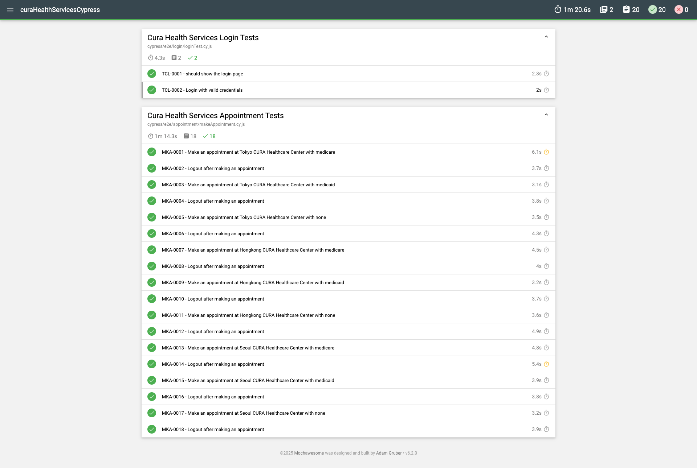

# Automation Testing Using Cypress 

This project provides an automated testing use Cypress framework for Cura Health Services applications.


## Prerequisites
Before running the tests, ensure you have the following installed:

* Node.js (Latest LTS version recommended)
* npm

## Installation


```bash
    clone https://github.com/RaizaKurniawan/curaHealthServicesCypress.git
    cd curaHealthServicesCypress
```

```bash
    npm install 
    npm i --save-dev cypress-mochawesome-reporter
```
    
## Running Tests

To run tests, run the following command

```bash
  npx cypress run --spec "cypress/e2e/**/*.cy.js"
  
``` 


## Screenshots



